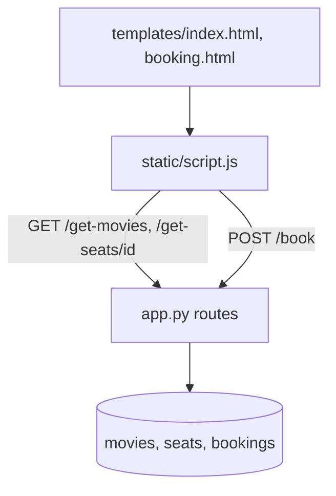

# Movie Ticket Booking (Flask + SQLite)

**A small Flask web app to pick a movie, choose seats on a seat map and book them, with SQLite storage.**

     

**movie-ticket-booking** is a beginner full-stack project. On start, `app.py` creates a SQLite database (`booking.db`)
with `movies`, `seats` and `bookings` tables and seeds three films (Inception, Avengers: Endgame, Interstellar) with 20
seats each (A1–D5). The home page loads movies from `/get-movies`; choosing one shows a seat map from
`/get-seats/<id>`; selecting seats updates a count and total at ₹150 per seat; **Book Now** posts to `/book`, which marks
available seats as booked and records each booking. Already-booked seats are reported back as failures.

## Table of contents

1. [At a glance](#at-a-glance)
2. [Key features](#key-features)
3. [Tech stack](#tech-stack)
4. [Architecture in one picture](#architecture-in-one-picture)
5. [Repository structure](#repository-structure)
6. [Getting started](#getting-started)
7. [Configuration](#configuration)
8. [Available scripts](#available-scripts)
9. [Testing](#testing)
10. [Deployment](#deployment)
11. [Documentation](#documentation)
12. [Project status](#project-status)
13. [Contributing](#contributing)
14. [Security](#security)
15. [Licence](#licence)
16. [Contacts](#contacts)

## At a glance

|  |  |
|---|---|
| What it is | A demo cinema booking site with three movies and a 20-seat map per movie. |
| Who it is for | Students and reviewers learning full-stack basics. |
| Status | Learning project (Sept 2025) — complete demo |
| Primary language | Python + JavaScript |
| Hosting | Not deployed — runs locally |
| Repository | Public — `HiravK/movie-ticket-booking` |
| Default branch | `main` |
| Commits / first / latest | 1 commits · 2025-09-06 → 2025-09-06 |
| Contributors | hiravk (1) |

## Key features

- **Auto database setup** — Tables created and seeded on first run
- **Movie list** — GET /get-movies
- **Seat map** — GET /get-seats/<movie_id> returns seat numbers and status
- **Booking** — POST /book with movie_id, seat_number (string or list) and username; partial failures reported
- **Pricing** — ₹150 per seat calculated in the browser

## Tech stack

| Layer | Technology | Why it is used |
|---|---|---|
| Backend | Python 3, Flask | Routes and API |
| Database | SQLite (sqlite3) | Storage |
| Frontend | HTML, CSS, vanilla JS | Seat map |

## Architecture in one picture



Full detail: [docs/ARCHITECTURE.md](docs/ARCHITECTURE.md).

## Repository structure

```text
movie-ticket-booking/
├── app.py
├── templates/index.html, booking.html
├── static/script.js, style.css
└── README.md
```

## Getting started

### Prerequisites

- Python 3.9+

### Install and run locally

```bash
git clone https://github.com/HiravK/movie-ticket-booking.git
cd movie-ticket-booking
pip install flask
python app.py        # http://127.0.0.1:5000 (creates booking.db)
```

## Configuration

No environment variables or secrets are required.

## Available scripts

| Command | What it does |
|---|---|
| `python app.py` | Run the app |

## Testing

No automated tests. See [docs/PROJECT.md](docs/PROJECT.md#quality-and-testing).

## Deployment

Not deployed. Step-by-step: [docs/RUNBOOK.md](docs/RUNBOOK.md).

## Documentation

Every document below is part of the project's controlled documentation set.

| Document | Audience | What it answers |
|---|---|---|
| [README](README.md) | Everyone | What is it, how do I run it, where is everything? |
| [Project Overview (in depth)](docs/PROJECT.md) | Everyone | Why it exists, every feature explained, timeline, quality, security, risks, glossary |
| [Product Requirements (PRD)](docs/PRD.md) | Product, business, engineering | What problem, for whom, what must it do, how is success measured? |
| [Architecture](docs/ARCHITECTURE.md) | Engineers, architects | How is it built, how does data flow, where does it run, why? |
| [Runbook](docs/RUNBOOK.md) | Engineers, operators | How do I set it up, configure, deploy, roll back and troubleshoot it? |
| [Session Handover](docs/SESSION_HANDOVER.md) | Next owner / next session | Where exactly did work stop and what is next? |

## Project status

A finished single-commit demo from 2025-09-06. No work in progress.

Latest hand-off notes: [docs/SESSION_HANDOVER.md](docs/SESSION_HANDOVER.md).

## Contributing

Branch from the default branch (`feat/…`, `fix/…`), use Conventional Commit messages, open a pull request, and update the docs in the same PR.

## Security

Please do not open public issues for vulnerabilities; contact the maintainer privately. Security design is covered in [docs/PROJECT.md](docs/PROJECT.md#security-and-privacy).

## Licence

No licence file is present, so all rights are reserved by the owner by default. Add a `LICENSE` file before accepting outside contributions or reuse.

## Contacts

| Role | Name | Contact |
|---|---|---|
| Owner / maintainer | Hirav Kadikar | [@HiravK](https://github.com/HiravK) |
