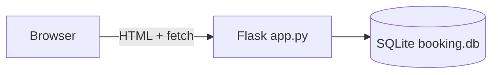
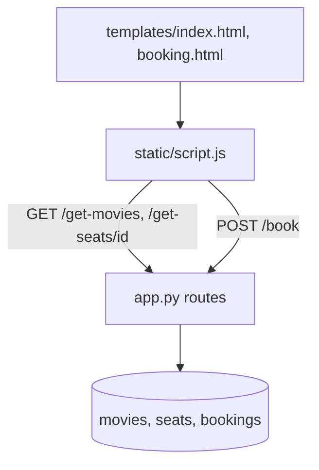
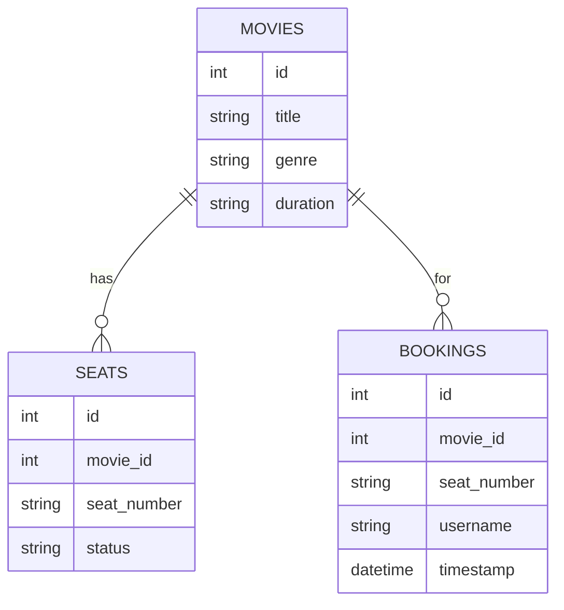

# Architecture Document — Movie Ticket Booking (Flask + SQLite)

| Field | Value |
|---|---|
| Document ID | MTB-ARCH |
| Project | Movie Ticket Booking (Flask + SQLite) |
| Repository | [`HiravK/movie-ticket-booking`](https://github.com/HiravK/movie-ticket-booking) |
| Version | 1.0 |
| Status | Approved — living document |
| Owner | Hirav Kadikar |
| Classification | Public |
| Last updated | 2026-09-25 |

> **Purpose:** Explains how the system is built: its parts, how data moves, where it runs, and why it was built this way. Structured on the C4 model and arc42.


## 1. Revision history

| Version | Date | Author | Change |
|---|---|---|---|
| 1.0 | 2026-09-25 | Hirav Kadikar | Full documentation suite generated from a complete review of the repository. |


## 2. Introduction and goals

One Flask app serves two templates and a JSON API; static JS drives the UI. SQLite (`booking.db`, git-ignored) is
opened per request with `sqlite3.connect`. Booking loops over requested seats, checks `status`, updates to `booked` and
inserts a booking row, then commits once.


### Quality goals (in priority order)

| Priority | Quality attribute | What it means here |
|---|---|---|
| 1 | Clarity | Readable, minimal code |
| 2 | Correctness | No seat booked twice |


## 3. Constraints

_None recorded._


## 4. System context (C4 level 1)

Who and what the system talks to.



| External actor / system | Interaction |
|---|---|
| Flask | Web server |
| SQLite | Storage |


## 5. Containers (C4 level 2)




## 6. Components (C4 level 3)

| Component | Location | Responsibility |
|---|---|---|
| Flask app | `app.py` | DB init + seed, routes |
| Templates | `templates/index.html, templates/booking.html` | Pages |
| Front-end logic | `static/script.js` | Load movies/seats, selection, price, booking call |
| Styles | `static/style.css` | Layout |


## 7. Runtime view — key flows


### Book two seats

```mermaid
sequenceDiagram
  actor U as User
  participant JS as script.js
  participant F as /book
  participant DB as SQLite
  U->>JS: select A1, A2, click Book Now
  JS->>F: POST {movie_id, seat_number:[A1,A2], username}
  loop each seat
    F->>DB: SELECT status
    alt available
      F->>DB: UPDATE seats booked; INSERT booking
    else booked
      F->>F: add to failed
    end
  end
  F->>DB: COMMIT
  F-->>JS: success or failed list
```


## 8. Data architecture

SQLite file `booking.db` next to app.py (git-ignored, created on first run).




### Interfaces / API endpoints

| Method | Path | Auth | Purpose | Request → Response |
|---|---|---|---|---|
| GET | `/` | Public | Home page | — → HTML |
| GET | `/get-movies` | Public | List movies | — → [{id, title}] |
| GET | `/get-seats/<movie_id>` | Public | Seats and status | — → [[seat, status]] |
| POST | `/book` | Public | Book seats | {movie_id, seat_number, username} → {success, message} |


## 9. Deployment view

Not deployed.

| Environment | Where | Notes |
|---|---|---|
| Local | http://127.0.0.1:5000 | Flask dev server |


## 10. Technology stack

| Layer | Technology | Why |
|---|---|---|
| Backend | Python 3, Flask | Routes and API |
| Database | SQLite (sqlite3) | Storage |
| Frontend | HTML, CSS, vanilla JS | Seat map |


## 11. Cross-cutting concepts


## 12. Architecture decisions (ADR log)


### ADR-01: SQLite with auto-seeding

|  |  |
|---|---|
| Status | Accepted |
| Date | 2025-09-06 |
| Context | Zero-setup demo. |
| Decision | Create tables and seed data at import time. |
| Consequences | Runs immediately; Not suitable for concurrent production use |
| Alternatives considered | — |


## 13. Quality scenarios

_None recorded._


## 14. Risks and technical debt

Full register in [PROJECT.md](PROJECT.md#risks-and-technical-debt). Top items:

- **Double booking under concurrency** — Atomic update


## 15. Glossary

See [PROJECT.md](PROJECT.md#glossary).
